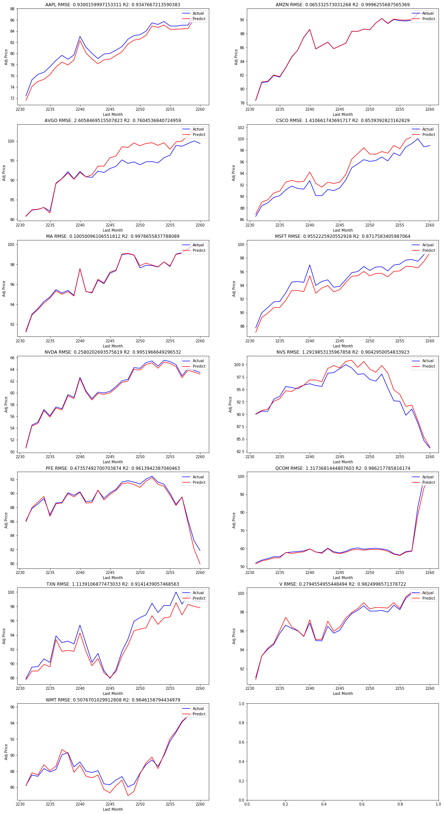

# Machine Learning Engineer Nanodegree
## Capstone Project: Stock Price Indicator
Ömer Faruk BÜLBÜL  
June 22nd, 2019

## I. Definition

### Project Overview

Investment firms, hedge funds and even individuals have been using financial models to better understand market behaviour and make profitable investments and trades. Since investor behaviour often deviates from logic and reason, and investors display many behaviour biases that influence their investment decision-making processes[1], it is important to construct an investment strategy in terms of strict algorithmic rules. 

Financial modeling is the task of building an abstract representation (a model) of a real world financial situation.[2] This is a mathematical model designed to represent (a simplified version of) the performance of a financial asset or portfolio of a business, project, or any other investment. Realistic financial models which require great effort are than used by financial analysts to anticipate the impact of an economic policy change or any other event on a company's stock to predict the future price of the stock. In quantitative finance, financial modeling entails the development of a sophisticated mathematical model. Models here deal with asset prices, market movements, portfolio returns and the like.

There are so many factors involved in the prediction – physical factors vs. physhological, rational and irrational behaviour, etc. All these aspects combine to make share prices volatile and very difficult to predict with a high degree of accuracy. Since finance area dynamics are very complex and stock prices depend on so many factors, machine learning can be a good solution if a suitable subset of these factors is selected and a reasonable performance is targeted. A wealth of information is available in the form of historical stock prices and company performance data, suitable for machine learning algorithms to process for constructing a financial model predicting the stock price of companies. There are lots of websites and web services for gathering historical stock price and financial performance data including Yahoo Finance, Google Finance etc. 

There are many successful implementations to make an estimator for stock prices using machine learning methods like linear regression, svm, lstm, arima etc. one of which creates a framework with neural networks and decision forests.[3] In their "A machine learning based stock trading framework using technical and economic analysis" work they have managed to beat S&P500 Index by far according to charts provided.

Hedge fund research firm Eurekahedge has published some informative data. The chart below displays the performance of the Eurekahedge AI/Machine Learning Hedge Fund Index vs. traditional quant and hedge funds from 2010 to 2016. The Index tracks 23 funds in total, of which 12 continue to be live.

With following table provided, Eurekahedge notes that:

“AI/machine learning hedge funds have outperformed both traditional quants and the average hedge fund since 2010, delivering annualized returns of 8.44% over this period compared with 2.62%, 1.62% and 4.27% for CTA’s, trend-followers and the average global hedge fund respectively.”
Performance in numbers – AI/Machine Learning Hedge Fund Index vs. quants and traditional hedge funds

With the information provided by Eurekahedge it is clear that machine learning algorithms are very usefull for constructing successfull investment strategies. Similarly I would like to implement a stock price indicator with machine learning methodologies aiming to predict future stock price for a given stock. 

### Problem Statement

The problem is predicting the actual value of adjusted close price of a requested stock for a requested day with 5-10 days of previous data in the form of average values provided.

For this project, I will try to build a stock price predictor that takes daily trading data over 5 or 10 days as input of requested stock, and outputs projected estimates for given query dates. The predictor given open price(open), highest price(highest), volume, adjusted close price(adjusted close) will only predict Adjusted Close price for a given stock. The predicted value can easily be compared and a benchmark can easily be set up with actual adjusted price of the requested date for various dates upon request.

Since we are trying to predict a value this problem is a regression problem. We take historical stock market values and try to predict adjusted close price of the stock. We will be constructing several predictive models which investigates the relationship between a dependent (target) and independent variable (s) (predictor). We will try to forecast, time series modeling and finding the causal effect relationship between the variables.

### Metrics

I would like to use R2 and RMSE(root mean squared error) for evaluation metrics which are frequently used for estimation error calculations.
With the following formulas:

<table align="center"> 
  <tr><td></td></tr>
  <tr><td></td></tr>
</table>

We will look at the deviation by calculating the RMSE of the model. If the deviation is big RMSE score will be far away from 0. Simply put, the lower the value the better and 0 means the model is perfect. Since we do not want high deviation for our predictions we would like to have RMSE score near to 0.

For a regression with an intercept, 𝑅2 is between 0 and 1, and from its definition 𝑅2=1−𝑆𝑆𝐸/𝑇𝑆𝑆 we can find an interpretation: 𝑆𝑆𝐸/𝑇𝑆𝑆 is the sum of squared errors divided by the total sum of squares, so it is the fraction ot the total sum of squares that is contained in the error term. So one minus this is the fraction of the total sum of squares that is not in the error, or 𝑅2 is the fraction of the total sum of squares that is 'explained by' the regression.

## II. Analysis
_(approx. 2-4 pages)_

### Data Exploration

I used 13 different stocks' historical stock prices saved to "data" folder of this project. Each file is in the csv format and containing approximately 9 years of historical stock market data. Data saved are from Yahoo Finance website with python code and open to public use. The symbols of the stocks in alphabetical order is: AAPL, AMZN, AVGO, CSCO, MA, MSFT, NVDA, NVS, PFE, QCOM, TXN, V, WNT. Historical Data of stock prices can be easily gathered using https://pypi.org/project/yahoo-finance/ project or pandas data reader commented in first code cell of the project.

In the csv files columns are: 
1- Date: The date which market was open and stock is exchanged.
2- Open: The price which first transaction of the day was occured.
3- High: Highest price of the day
4- Low: Lowest price of the day
5- Close: The price which last transaction occured.
6- Adjusted Close: The adjusted closing price is a useful tool when examining historical returns because it gives analysts an accurate representation of the firm's equity value beyond the simple market price. It accounts for all corporate actions such as stock splits, dividends/distributions and rights offerings.
7- Volume: The number of shares that changed hands during a given day.  

In order to have good predictions we need to get trend of the stock market. If close, adjusted close price of a stock is greater than open price it clearly shows a bullish market rather than a bearish one. So relations between open price and close price will be very important for predicting the requested days adjusted close price. Also volume is very important since volume reflects the intensity (strength) of a stock. Volume also provides an indication of the quality of a price trend and the liquidity of a stock. Highest price and lowest price values when compared to open price and close price are used to interpret trend of the stock by financers.
A trend analysis can be done with volume and price like in the below table [4].
General Rules in Volume Analysis:

<table align="center"> 
  <th>Volume</th><th>Price</th><th>Interpretation</th>
  <tr><td>Increasing</td><td>Rising</td><td>bullish</td></tr>
  <tr><td>Decreasing</td><td>Falling</td><td>bullish</td></tr>
  <tr><td>Increasing</td><td>Falling</td><td>bearish</td></tr>
  <tr><td>Decreasing</td><td>Rising</td><td>bearish</td></tr>
</table>

Here is an example of data structure:

<table>
      <thead>
        <tr>
            <th>Date</th>
            <th>Open</th>
            <th>High</th>
            <th>Low</th>
            <th>Close</th>
            <th>Adj Close</th>
            <th>Volume</th>
        </tr>
      </thead>
      <tbody>
          <tr>
              <td>2019-01-28</td>
              <td>155.789993</td>
              <td>156.330002</td>
              <td>153.660004</td>
              <td>156.300003</td>
              <td>155.632523</td>
              <td>26192100</td>
          </tr>
        <tr>
              <td>2019-01-29</td>
              <td>156.250000</td>
              <td>158.130005</td>
              <td>154.110001</td>
              <td>154.679993</td>
              <td>154.019440</td>
              <td>41587200</td>
          </tr>
          <tr>
              <td>2019-01-30</td>
              <td>163.250000</td>
              <td>166.149994</td>
              <td>160.229996</td>
              <td>165.250000</td>
              <td>164.544296</td>
              <td>61109800</td>
          </tr>
  </tbody>
</table>

Typically every dataframe(stock historical file) have more than 2000 rows. In cell 3 I checked if a null value was existing in the data but i could not found any, so I did not need to do anything to cover null values.

### Exploratory Visualization
In cell 4 I added frequetly used trend analysis formulas to the data as additional columns in order to have better results and in cell 5 I plotted original adjusted close price, bollinger bands and weighted moving average calculated. We can consider bollinder bands as standard deviation margins from current price of the stock. Also moving averages provide trend information for the data.

### Algorithms and Techniques

So we have timeseries data that we would like to have a regression and predict adjusted close price of the next market day.
So we have lots of methodologies we could apply to the problem. Namely, we can apply simple linear regression, support vector machines regression algorithms, logistic regression, multiple regression algortihm, long short term memory(LSTM) regression etc.

For the project I chose following techniques to tackle the problem:

1- SVM Linear/Polynomial Regression: 
This supervised machine learning algorithm has strong regularization and can be leveraged both for classification or regression challenges. They are characterized by usage of kernels, the sparseness of the solution and the capacity control gained by acting on the margin, or on number of support vectors, etc. The capacity of the system is controlled by parameters that do not depend on the dimensionality of feature space. Since the SVM algorithm operates natively on numeric attributes, it uses a z-score normalization on numeric attributes. In regression, Support Vector Machines algorithms use epsilon-insensitivity (margin of tolerance) loss function to solve regression problems.
Support vector machines regression algorithms has found several applications in the oil and gas industry, classification of images and text and hypertext categorization. In the oilfields, it is specifically leveraged for exploration to understand the position of layers of rocks and create 2D and 3D models as a representation of the subsoil.
I chose error penalty coefficient C as 100 for both linear and polynomial regressors. For the polynomial regressor I chose gamma as auto mode, polynomial degree as 3 and epsilon as 0.1.

2- LSTM: 
LSTM networks are well-suited to classifying, processing and making predictions based on time series data, since there can be lags of unknown duration between important events in a time series. LSTMs were developed to deal with the exploding and vanishing gradient problems that can be encountered when training traditional RNNs. Relative insensitivity to gap length is an advantage of LSTM over RNNs, hidden Markov models and other sequence learning methods in numerous applications
Since The Long Short-Term Memory recurrent neural network has the promise of learning long sequences of observations I chose it for using it as a regressor for a time period of approximately 9 years.
I chose 100 nodes with dropout rate of 20% with activation linear and optimizer as rmrsprop.

### Benchmark
As a benchmark for the problem, simple linear regression is a statistical method that enables users to summarise and study relationships between two continuous (quantitative) variables. Linear regression is a linear model wherein a model that assumes a linear relationship between the input variables (x) and the single output variable (y).
Some of the most popular applications of Linear regression algorithm are in financial portfolio prediction, salary forecasting, real estate predictions and in traffic in arriving at ETAs.
I have chosen simple linear regression method for benchmarking because it is the simplest method for regression. This benchmark is frequently used for regression problems. We know that R2 score will be very near to 1 when we have a good predictor for the problem. From the results very near to 1 at the end of the report we can say that a simple linear regression method is a challenging benchmark to be selected for the methods implemented. For the linear regression I chose learning rate as 0.2 having 10 nodes and 10 epochs.

## III. Methodology

### Data Preprocessing
For preprocessing data, I needed to eliminate NaN or null values, normalize, put additional frequently used trend analysis information methodologies in order to have a successfull learning. I have followed the following steps:

1- Download data from Yahoo Finance servers with pandas datareader into 13 different pandas dataframes.
2- Check for null values if there is any. I encountered no null values so I made no action for null values.
3- Add MACD (Moving Average Convergence Divergence) Data for column Adjusted Close for every data frame for 26, 12 day periods. This is a very frequently used trend information.
4- Add RSI(Relative Strength Index) for period 14 days.
5- Add Bollinger Bands namely standard deviation margins informations in column up and low.
6- Delete first 25 rows of every dataframe since we have added NaN values to newly added columns.
7- Plot data with newly added information in order to check for any mistakes not confirming with data
8- Normalize data with sklearn preprocessing minmaxscaler and multipy adjusted close with 100 to scale up to 100
(I also tried without normalizing the adjusted column and saved results for that case)
9- seperate y values column namely adjusted close price column from dataframes
10- Shift backward 1 days y values dataframes since we are trying to predict (n+1)th day with nth day input
11- Also for lstm network I needed to turn data into three dimensional array

### Implementation

I have used Jupyter Notebooks as development environment backed up with python 3.6 having numpy, scipy, pandas, pandas-datareader, matplotlib, scikit-learn, tensorflow, keras.

After preprocessing the data I have done the following steps:

1- Plan: 
I have planned implentation in the following order as stated between code cell 6 and 7: Benchmark Model, RMSE and R2 Validation, Solution Model, Create Test Flow

2- Create Benchmark Model: 
I have selected simple linear regression for benchmarking. With Keras: The Python Deep Learning library it is very easy to implement a simple linear regression by adding a dense layer consisting of only 1 node with activation type of linear. With Stochastic gradient descent as optimizer with learning rate 0.2.

3- Create Metrics
I have chosen to use two metrics for comparing the results of learning techniques R2 and RMSE. These metrics are already provided by sklearn and I added a little informative lines to print stating method and score.

4- Create Solution Models:
In order to use in test flow I have implemented 3 methods returning models created.
First method of support vector machine regressor is very straight forward with sklearn libraries having the option linear and penalty coefficient 100.
todo: take screenshots

Second method of SVM regressor has polynomial kernel and gamma is in auto mode with third degree polynomial fitting.

Thirdly, I have created an lstm model having 100 nodes with dropout rate of 0.2 followed by a flattening layer and a dense layer of one node for final prediction.

5- For test flow I wondered what will be the effect of using single model for 13 stocks and 13 diffreent models for each stock. So for the test flow I set a parameter for calling different models and single model.
I simply created models, split data fit models, get predictions and than keep the r2, rmse scores after calling the check score.
  

### Refinement

Here is an initial solution result for the problem. It is clear that RMSE namely deviation of the error depends on the value of the price so I decided to normalize the adj. close value and than run the solution again. It is clear that stocks with heigher prices rmse scores reduced and rmse values approached to each other.
<table>
      <tbody>
          <tr>
            <td>
    </td>
            <td>
    </td>
        </tr>
  </tbody>
</table>
I than tried having two layers of lstm of 10 nodes to have better reults but it ended in a slightly worse result. Also trying tanh and softmax functions ended in local minimas having poor results. Since benchmark and lstm results are very near I stopped trying to make lstm results better.

As far as the methods I tried best performing method is SVR polynomial. This method has very good R2 mean for stocks which is 
0.9995363077 and very near to 1. This indicates that this model can be definetly used as an estimator for stock prices given the supportive information extracted from the stock market prices.

I was expecting better results in LSTM technique but SVR polynomial was better in results. In the next few weeks I will try configure a better LSTM network which can outperform SVR polynomial.

For the SVR definetly polynomial kernel performs better than linear one and also it is better than the benchmark. I have added a grid search similar section at the end of bar charts for SVM polynomial solution configuration generating the following results. 
For the C Value C = 50, 100, 200 vales are tried and following mean values are gathered. C=200 can be selected

<table>
      <thead><tr><th></th><th>RMSE</th><th>R2</th></tr></thead>
      <tbody>
        <tr><td>default</td><td>0.404407</td><td>0.999515</td></tr>
        <tr><td>c200</td><td>0.382911</td><td>0.999563</td></tr>
        <tr><td>c50</td><td>0.436590</td><td>0.999446</td></tr>
      </tbody>
</table>

For the gamma value gammma = 0.1, 0.2, 0.4, 0.8 values are tried and following results are gathered. gamma = 0.8 can be selected

<table>
      <thead><tr><th></th><th>RMSE</th><th>R2</th></tr></thead>
      <tbody>
        <tr><td>default</td><td>0.404407</td><td>0.999515</td></tr>
        <tr><td>gamma_dot2</td><td>0.364122</td><td>0.999563</td></tr>
        <tr><td>rmse_gamma_dot4</td><td>0.315261</td><td>0.999716</td></tr>
      </tbody>
</table>

For polynomial if we use degree 4 it gives better results.

<table>
      <thead><tr><th></th><th>RMSE</th><th>R2</th></tr></thead>
      <tbody>
        <tr><td>default</td><td>0.404407</td><td>0.999515</td></tr>
        <tr><td>c200</td><td>0.382911</td><td>0.999563</td></tr>
        <tr><td>c50</td><td>0.436590</td><td>0.999446</td></tr>
        <tr><td>gamma_dot2</td><td>0.364122</td><td>0.999605</td></tr>
        <tr><td>rmse_gamma_dot8</td><td>0.315261</td><td>0.999716</td></tr>
        <tr><td>degree4</td><td>0.280099</td><td>0.999778</td></tr>
      </tbody>
</table>

## IV. Results

### Model Evaluation and Validation

The final model as optimized in a manual grid search is SVR with parameters gamma=0.8, C=200, degree=3 since it gives the best results overall. In the refinement section first two images of summary including all the methodologies both for R2 and RMSE scores the best option was the SVR method.
For checking the robustness of the solution when we apply gaussian noise to Open, High, Close columns of the test data we get the following tables. When we apply gaussian noise we see that gathered information is still enough to predict better than most of the 0.75 R2 most of the time. It looks like small perturbations made to input data does not affect performance drastically.

<table>
      <thead>
            <tr><th>Original Data</th><th></th><th>Perturbed Data</th><th></th></tr>
            <tr><th>R2</th><th>RMSE</th><th>R2</th><th>RMSE</th></tr>
      </thead>
      <tbody>
        <tr><td>0.9348</td> <td> 0.9300 </td><td> 0.8780 </td><td> 1.2720</td></tr>
        <tr><td>0.9996</td> <td> 0.0653 </td><td> 0.9129 </td><td> 0.9963</td></tr>
        <tr><td>0.7605</td> <td> 2.6058 </td><td> 0.7573 </td><td> 2.6230</td></tr>
        <tr><td>0.8539</td> <td> 1.4107 </td><td> 0.7500 </td><td> 1.8454</td></tr>
        <tr><td>0.9979</td> <td> 0.1005 </td><td> 0.7402 </td><td> 1.1089</td></tr>
        <tr><td>0.8718</td> <td> 0.9552 </td><td> 0.7720 </td><td> 1.2736</td></tr>
        <tr><td>0.9952</td> <td> 0.2580 </td><td> 0.9192 </td><td> 1.0579</td></tr>
        <tr><td>0.9043</td> <td> 1.2920 </td><td> 0.9013 </td><td> 1.3120</td></tr>
        <tr><td>0.9614</td> <td> 0.4736 </td><td> 0.9601 </td><td> 0.4816</td></tr>
        <tr><td>0.9862</td> <td> 1.3174 </td><td> 0.9865 </td><td> 1.3026</td></tr>
        <tr><td>0.9141</td> <td> 1.1139 </td><td> 0.8930 </td><td> 1.2434</td></tr>
        <tr><td>0.9825</td> <td> 0.2795 </td><td> 0.6286 </td><td> 1.2873</td></tr>
        <tr><td>0.9646</td> <td> 0.5077 </td><td> 0.9570 </td><td> 0.5594</td></tr>
      </tbody>
</table>

Since ideal R2 score is 1 and our results are very near to 1 most of the time and also RMSE namely the deviation is small enough we can trust this solution to build an investment strategy on top of it.

### Justification

When we compare benchmark and optimized SVR results it is clear that the performance of the SVR method is better than the 
benchmark in terms of both R2 and RMSE metrics as seen below. There is a significant improvement at the RMSE metric which show the deviation of the solution is declined very much. This predictor can be used for predictions since it has good scores of both R2 and RMSE.

<table>
      <thead><tr><th></th><th>RMSE</th><th>R2</th></tr></thead>
      <tbody>
          <tr><td>best</td><td>0.280099</td><td>0.999778</td></tr>
          <tr><td>benchmark</td><td>0.810680</td><td>0.998444</td></tr>
      </tbody>
</table>

## V. Conclusion

### Free-Form Visualization

For the visualization I have downloaded last months stock market prices and tried the predictor after training with 9 years of data. The following figure for 12 stocks are plotted for predicted and actual prices. It looks like the predictor is successfull at predicting the price with R2 and RMSE scores. We have R2 score over 0.9 for most of the stocks.

### Reflection

To sum up in this project I tried to build a stock price predictor having input of stock market data. I followed the steps below.
1- Gather data
2- Explore and normalize data
3- Create metrics for comparison R2 and RMSE
4- Create benchmark
5- Create solution alternatives
6- Compare solution alternatives
7- Visualize result
8- perturb data to check robustness
When compared with the results of similar works, my metric scores was beyond my expectations. I will try to serve this work  in the after developing an investment strategy in the future.
Intertesting thing to notice was as far as I tried LSTM was poorly performing than SVR. I suppose this is because of non linear information added as column to data like MACD, Bollinger Bands and RSI. In future work I will investigate the effect of these columns.

### Improvement

Since I have a full time job I did not have enough time to investigate other methods before the deadline. After having such good results I will try to investigate the performance of other methodologies used frequently to predict timeseries data.

Definitely a stock price depends on not only previous exchange data but also company's financial performance and macro-economical conditions. So in order to have a better long term predictions we need to quantify those information and put into our information space. I suppose after having that done it would really be a good investment engine. 

[1] The Effects of Psychology on Individual Investors’ Behaviors: Evidence from the Vietnam Stock Exchange
http://www.ccsenet.org/journal/index.php/jms/article/download/39897/22142
[2] http://www.investopedia.com/terms/f/financialmodeling.asp
[3] A machine learning based stock trading framework using technical and economic analysis
http://cs229.stanford.edu/proj2017/final-reports/5234854.pdf
[4] Trading volume: What it reveals about the market from https://www.rediff.com/money/special/trading-volume-what-it-reveals-about-the-market/20090703.htm

